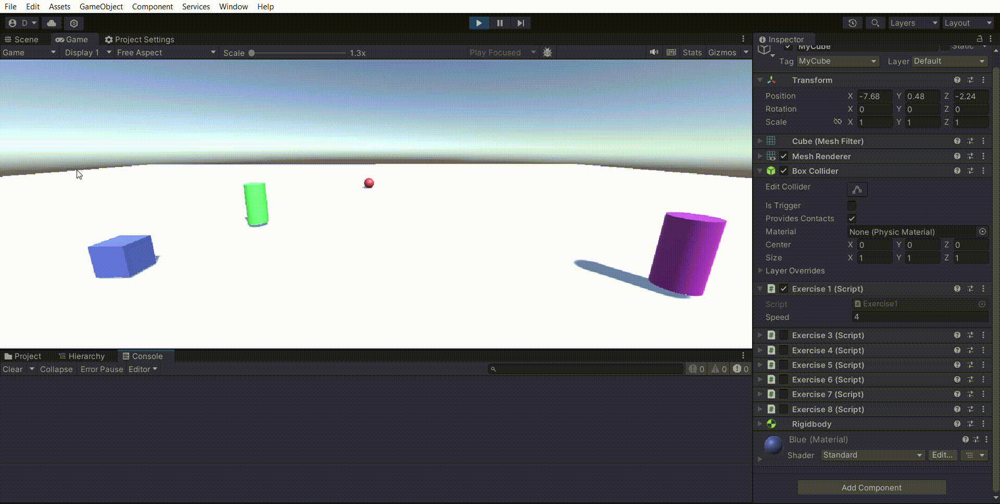
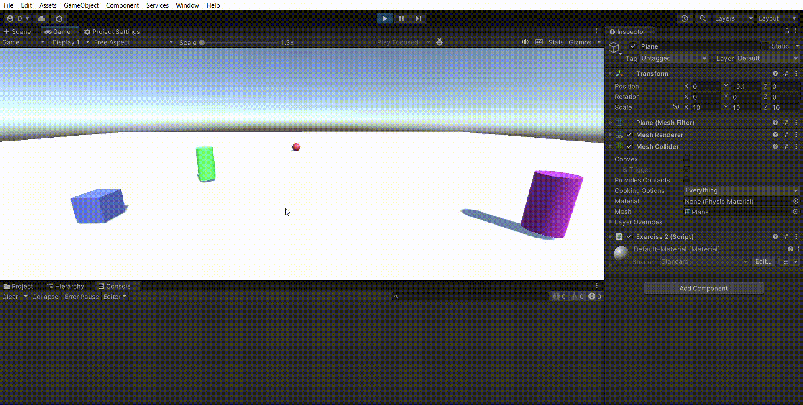
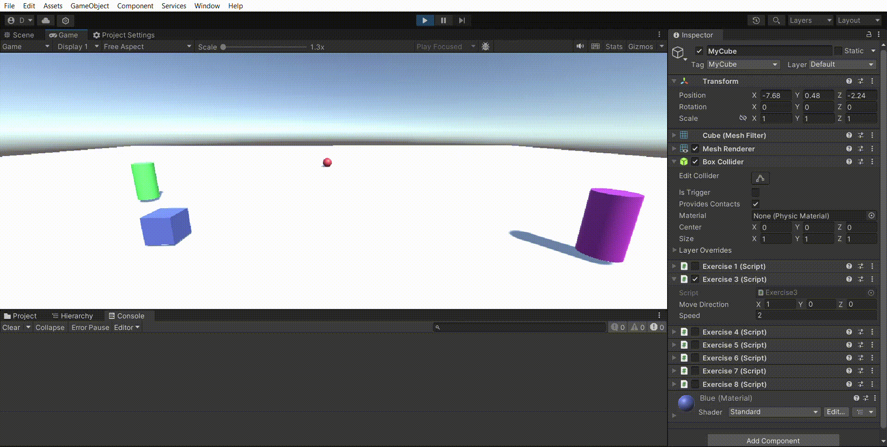
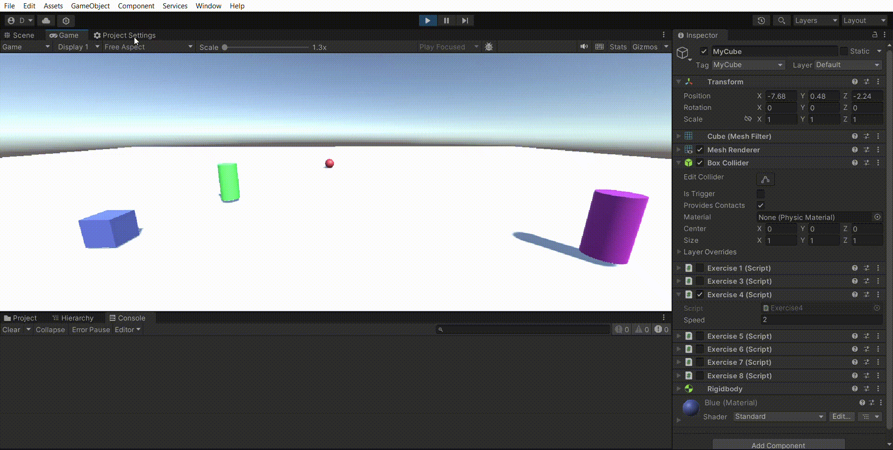
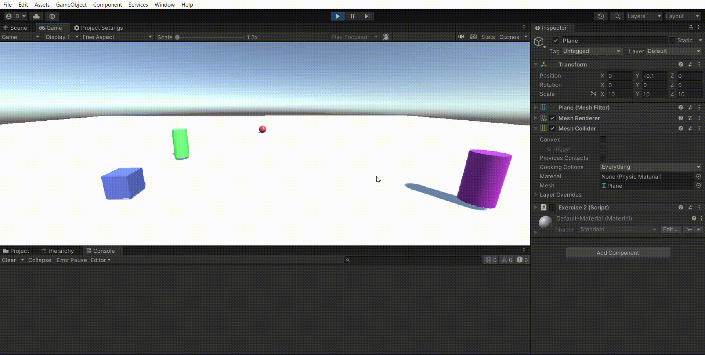
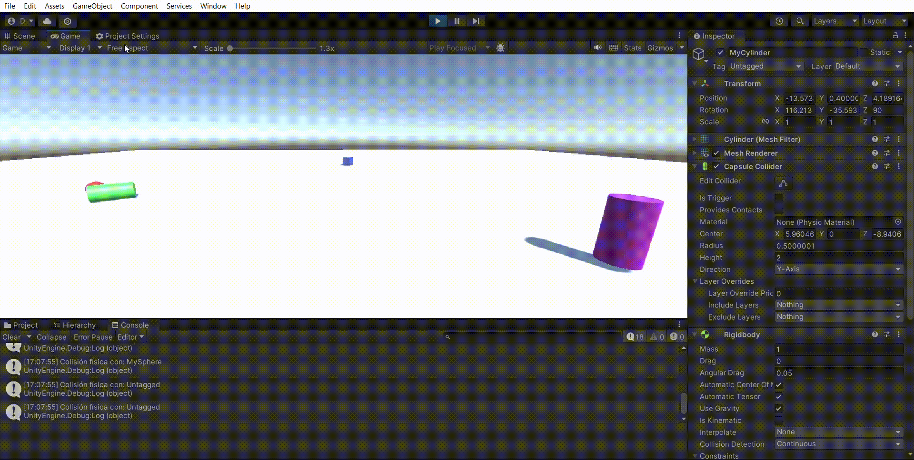
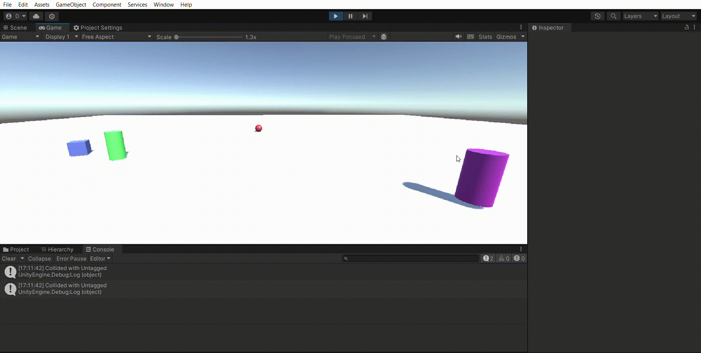
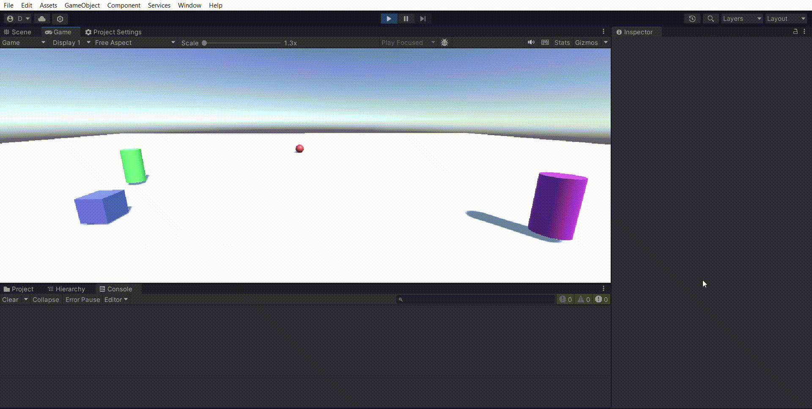

# II-P03-Physics

Para esta práctica hemos trabajado con diferentes aspectos de las físicas de Unity, la utilización de clases provenientes de la API de Unity como Input y las físicas (Collider, OnCollisionEnter, OnTriggerEnter...), etc.

A continuación se mostrará el resultado de cada ejercicio con un GIF.

## Ejercicio 1

## Ejercicio 2

## Ejercicio 3

## Ejercicio 4

## Ejercicio 5

## Ejercicio 6

## Ejercicio 7

## Ejercicio 8

## Ejercicio 9

## Ejercicio 10

## Ejercicio 11

## Ejercicio 12

